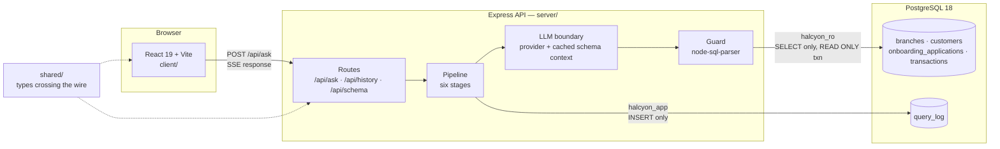
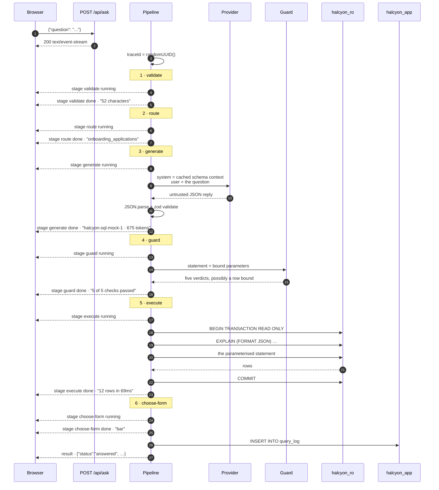
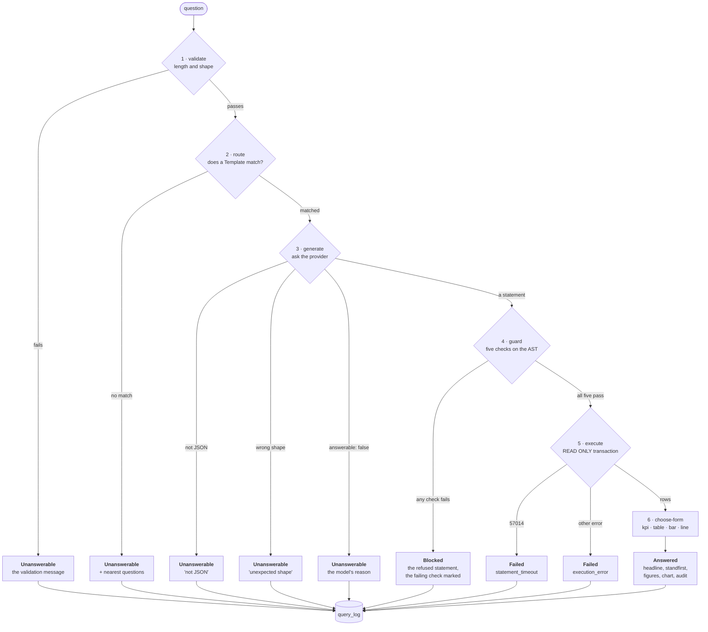
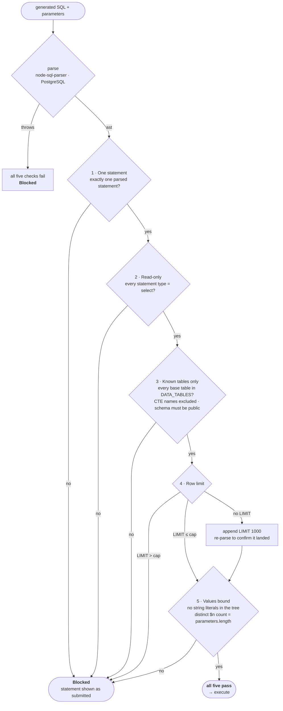
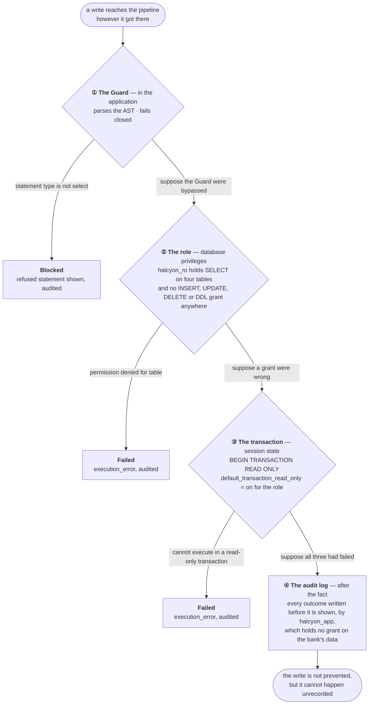
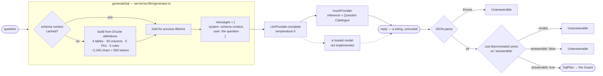
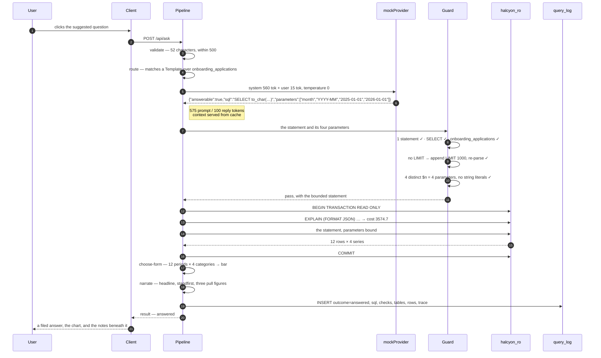
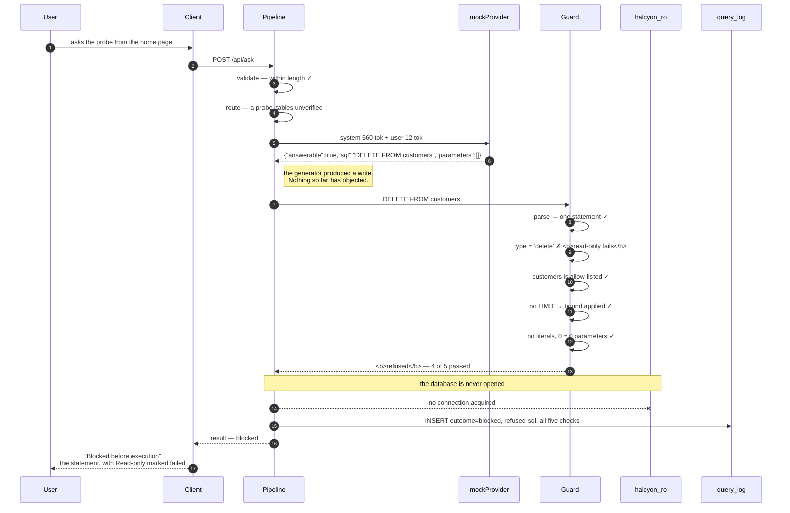
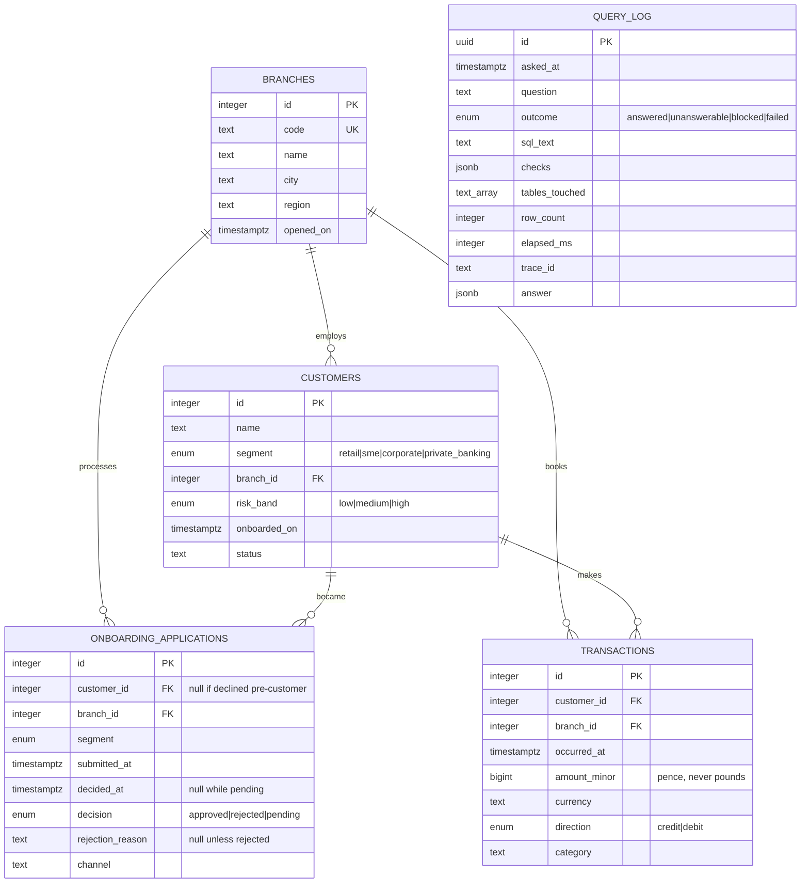

# Architecture

How a question becomes an answer, and what stops it becoming something else.

This document is the map. [CONTEXT.md](CONTEXT.md) defines the vocabulary it uses,
[docs/adr/](docs/adr/) records why each decision was taken, and
[PRODUCTION.md](PRODUCTION.md) covers what would change under real load with a real
model.

---

## 1. The system at a glance

Three packages and one database. The client renders, the server decides, and the
database is reached through two connections that hold different powers.

`shared/` holds every type that crosses the network, defined once and imported by both
ends, so a change to the wire format is a compile error rather than a runtime surprise.

---

## 2. The request, end to end

`POST /api/ask` responds with Server-Sent Events. Each of the six stages emits a
`running` frame and then a `done` or `skipped` frame, and a final `result` frame
carries the outcome. The client uses `fetch` rather than `EventSource`, because
`EventSource` cannot send a request body.

Every frame is the same shape on the wire — `data: <JSON>\n\n` — and the JSON's `type`
field discriminates. There are no named SSE events.

Two details in that diagram are load-bearing.

**The audit row is written before the terminal frame is sent.** The user cannot be
shown an answer that was not recorded.

**Timings are measured, not simulated.** The client holds each completed stage on
screen for a minimum of 260 ms so the sequence is legible, but the numbers it displays
are the server's own — see
[ADR-0007](docs/adr/0007-pipeline-stages-are-streamed-not-simulated.md).

---

## 3. The six stages and the four outcomes

Every question ends in exactly one of four outcomes. Stages after the deciding one are
not skipped silently: each emits a `skipped` frame carrying the reason, so the UI can
show where the pipeline stopped and why.

Note that three of the five Unanswerable paths did not exist before generation ran
through a provider. A reply that is not JSON, is JSON of the wrong shape, or declines
the question are failure modes only a model has. They settle as ordinary outcomes with
a sentence explaining what arrived, rather than as exceptions.

The words matter and are not interchangeable — **Unanswerable** means nothing was
executed, **Blocked** means a statement existed and was refused, **Failed** means a
permitted statement did not complete. [CONTEXT.md](CONTEXT.md) is strict about this,
and `rejection` is reserved for what a bank does to an onboarding application.

---

## 4. The Guard

The Guard is the control that makes generated SQL safe to run. It sits downstream of
the generator precisely because a generator cannot be trusted the way a template can.

It parses the statement once with `node-sql-parser` in PostgreSQL dialect and works
entirely on the resulting tree. It never inspects the text, because a regular
expression can be defeated by a comment, an unusual quote or a nested construct, and a
parser cannot. If parsing throws, all five checks are marked failed with the parse
error, and nothing reaches the database. It fails closed.

Four things about this worth stating plainly.

**The allow-list is derived, not written down.** It is built from `DATA_TABLES`, the
same constant the schema exports. A table added to the database is not readable until
it is added there, and `query_log` is absent from it — which is why a generated query
cannot read the audit log even though the audit log is in the same database.

**The row limit is injected, not merely checked.** A statement without a `LIMIT` gets
one appended to the text as written, and the result is re-parsed to confirm the bound
actually landed. Appending rather than reconstructing from the tree matters, because
`sqlify()` returns the parser's idea of the statement — its own casing, its own quoting,
all on one line — and the audit block would then be showing a paraphrase under the
heading "as executed". See
[ADR-0009](docs/adr/0009-the-audit-shows-the-statement-as-written.md).

**String literals are refused outright.** Not escaped, not quoted — refused. The check
walks the whole tree for `single_quote_string`, `string` and `double_quote_string`
nodes, and requires the count of distinct `$n` placeholders to equal the number of
parameters supplied. Numeric literals are permitted.

**A refusal shows what was submitted.** Not the Guard's rewrite. An audit trail that
edits the evidence before presenting it is not an audit trail.

---

## 5. Defence in depth

Four independent controls. Each would be sufficient on its own to prevent a write, and
none is relied on alone. The diagram reads downward: each branch asks what would happen
if every control above it had failed.

The same three rings bound cost as well as damage: `statement_timeout = 5s` and
`idle_in_transaction_session_timeout = 10s` are set on the role, and the Guard caps
rows at 1,000. A valid but ruinous query is cancelled rather than allowed to exhaust
the connection pool.

The second ring is the one worth dwelling on, because it is the one that holds if the
application is wrong. `pnpm db:verify` connects as `halcyon_ro` and attempts fourteen
operations that should fail — writes to each data table, reads of `query_log`, DDL, and
a query designed to exceed the timeout. It demonstrates the claim rather than asserting
it.

The separation in the fourth ring is deliberate and slightly unusual: the role that
writes the audit log holds no grant on the bank's data, and the role that reads the
bank's data holds no grant on the audit log. Neither can forge the other's evidence.

---

## 6. The LLM boundary

Generation goes through a provider whose interface is the shape a hosted completion
API has: messages in, content and a token count out. `mockProvider` implements it
without a network. Swapping in a hosted model is an implementation of `LlmProvider`
and a value in `LLM_PROVIDER` — nothing downstream moves.

**What is real and what is mocked.** The context, the message roles, the token
accounting, the untrusted reply and its validation are all genuine. Only the inference
in the middle is deterministic — the mock resolves the question through the Question
Catalogue. The statement that reaches the Guard is byte-identical to what the catalogue
produced before the provider existed, which is why every pre-existing test passed
unchanged when this was introduced.
[ADR-0010](docs/adr/0010-the-mock-provider-is-shaped-like-a-real-one.md) sets out the
reasoning; [ADR-0004](docs/adr/0004-no-llm-a-question-catalogue-behind-a-generator-interface.md)
is the decision it amends.

**Adversarial probes resolve inside the provider.** `DELETE FROM customers` arrives
_from the generator_ and is refused by the Guard on its contents. The demonstration is
not the pipeline recognising a question it was told in advance to decline.

**The context is cached because it is invariant.** A description assembled per question
is a cost paid on every request and a description that can drift from the database. The
cache is `cached ??= build()` and holds for the process lifetime, which is sound here
because the schema cannot change under a running server. Under continuous deployment
with online migrations it would not be — see
[PRODUCTION.md](PRODUCTION.md#the-schema-context-problem), which treats this as the
central question a real deployment has to answer.

**Row data never reaches the model.** The model is sent the schema and the question. It
is not sent results. Narration — the headline, the standfirst, the pull figures — is
computed locally from the returned rows. No customer record is ever part of a prompt.

---

## 7. Scenario: a question that is answered

> _"Show monthly onboarding applications by customer segment"_

The user sees the headline claim, a figure row, a grouped bar chart with a
chart/table toggle, and "Notes on this answer" containing the statement as executed,
the bound values, the five checks and the stage timings. The rail carries the tables
read, why a bar was chosen, what was assumed, and — collapsed — the model, provider and
token counts.

---

## 8. Scenario: a question that is blocked

> _"Delete all customer records"_

This is the path the product exists to demonstrate, so it is worth being precise about
where the refusal happens.

Three things this shows that a hardcoded refusal would not.

The statement came **from the generator**, not from a list of questions the pipeline was
told to decline. The Guard refused it on **its contents** — the parsed statement type —
not on the wording of the question. And **the other four checks still ran and still
report**, because a refusal that says only "no" cannot be audited; the user is shown
that four controls passed and precisely which one did not.

If the Guard were removed entirely, the statement would reach a role with no `DELETE`
grant inside a `READ ONLY` transaction, and PostgreSQL would refuse it. That is ring
two of [Defence in depth](#5-defence-in-depth), and `pnpm db:verify` demonstrates it.

---

## 9. Data model

Four tables the user can ask about, and one they cannot.

`query_log` is drawn apart from the others because it is unreachable from a question.
It is excluded in four independent places: it is not in `DATA_TABLES`, `halcyon_ro`
holds no grant on it, the Guard's allow-list is derived from `DATA_TABLES` so a
reference to it fails check three, and it is absent from the schema context so the
model has never been told it exists.

The same table is both the audit log and the history drawer, so the record the
compliance officer would read and the record the user sees cannot diverge —
[ADR-0005](docs/adr/0005-history-and-the-audit-log-are-one-table.md).

At the default `demo` seed scale: 32 branches, 48,000 customers, 32,000 onboarding
applications, 250,000 transactions.

---

## 10. Where things live

| Concern                                             | Path                                                      |
| --------------------------------------------------- | --------------------------------------------------------- |
| HTTP surface, middleware, CORS, rate limits         | `server/src/app.ts`                                       |
| The SSE endpoint                                    | `server/src/routes/ask.ts`                                |
| The six stages, and which outcome each produces     | `server/src/pipeline/ask.ts`                              |
| The five safety checks                              | `server/src/pipeline/guard.ts`                            |
| Read-only execution, timeouts, error classification | `server/src/pipeline/execute.ts`                          |
| Form selection and narration                        | `server/src/pipeline/choose-form.ts`, `narrate.ts`        |
| The provider contract and the mock                  | `server/src/llm/provider.ts`                              |
| Reply validation and token accounting               | `server/src/llm/generator.ts`                             |
| The cached schema context                           | `server/src/llm/schema-context.ts`                        |
| Question Templates, routing, adversarial probes     | `server/src/catalogue/`                                   |
| Roles, grants, pools                                | `server/src/db/roles.ts`, `pools.ts`                      |
| Audit writes                                        | `server/src/db/audit.ts`                                  |
| Wire types, shared by both ends                     | `shared/src/index.ts`                                     |
| Client state machine and stream reader              | `client/src/hooks/use-ask.ts`, `client/src/api/client.ts` |
