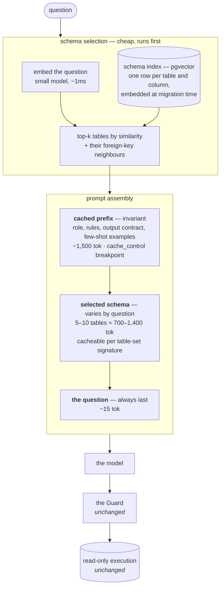

# Taking Halcyon to production

What this build decided, what a real deployment would change, and what would go wrong
on the way.

The short version: the controls survive contact with production almost unchanged, and
the generator does not. Every safety property in this product — the Guard, the
read-only role, the bounded transaction, the audit log — sits _downstream_ of the LLM
boundary and is indifferent to what produced the SQL. What has to be rebuilt is
everything on the model's side of that line, and the hardest part of it is the schema
context.

- [1. The schema context problem](#1-the-schema-context-problem)
- [2. The decisions this build took](#2-the-decisions-this-build-took)
- [3. What breaks under a real model](#3-what-breaks-under-a-real-model)
- [4. What breaks under real load](#4-what-breaks-under-real-load)
- [5. Security and data protection](#5-security-and-data-protection)
- [6. What would not change](#6-what-would-not-change)
- [7. A sequenced plan](#7-a-sequenced-plan)

---

## 1. The schema context problem

This is the decision that matters most, so it goes first.

To write SQL, a model has to be told what the tables are. Today Halcyon builds that
description once from the Drizzle definitions, caches it for the lifetime of the
process, and sends it as the system message on every call:

```
2,240 characters ≈ 560 tokens
4 tables · 30 columns · 5 foreign keys · 5 rules · 1 output contract
```

In-process caching means we build the string once. It does **not** mean we send it
once. Every call to a hosted provider would carry all 560 tokens again, because the
provider is stateless — it has no memory of the previous request.

That is fine at this size and catastrophic at the size a bank actually is. There are
two distinct problems hiding in one symptom, and they have different solutions.

### Problem one: the same tokens, over and over

The schema does not change between questions, but a stateless API charges for it every
time. At a plausible internal-tool volume — 200 analysts, 50 questions each per working
day — the arithmetic is:

|                     | Per request | Per day (10,000 requests) |        Per month |
| ------------------- | ----------: | ------------------------: | ---------------: |
| Schema context      |     560 tok |             5,600,000 tok | ~168,000,000 tok |
| The question itself |     ~15 tok |               150,000 tok |   ~4,500,000 tok |
| The reply           |    ~100 tok |             1,000,000 tok |  ~30,000,000 tok |

Ninety-seven percent of the input bill is one unchanging paragraph, re-sent 10,000
times a day.

**The fix is provider-side prompt caching.** Every major provider now caches a stable
prompt _prefix_ and charges a fraction of the input rate to read it back. With
Anthropic's implementation the mechanism is an explicit breakpoint:

```ts
system: [
  {
    type: 'text',
    text: schemaContext().text,
    cache_control: { type: 'ephemeral', ttl: '1h' },
  },
],
messages: [{ role: 'user', content: question }],
```

The economics, per [Anthropic's prompt caching documentation](https://platform.claude.com/docs/en/build-with-claude/prompt-caching):
a five-minute cache write costs 1.25× the base input rate, a one-hour write costs 2×,
and **cache reads cost 0.1× the base input rate**. Reads within the window refresh the
entry at no extra cost, so a prefix touched at least once every TTL stays warm
indefinitely. The response reports `cache_creation_input_tokens` and
`cache_read_input_tokens`, which means the saving is measurable rather than assumed —
the same standard this product already holds itself to by printing the context token
count in the rail.

For a tool with steady daytime traffic, essentially every request after the first is a
cache read. The schema portion of the bill drops by roughly 90%, and time-to-first-token
improves because the prefix does not have to be re-processed.

Two constraints govern how the prompt must be assembled, and both are easy to violate
by accident:

- **The prefix must match byte for byte.** Anything that varies — a timestamp, a user
  name, a request id — must go _after_ the cached block, never before or inside it. Our
  context is already deterministic and already first, which is the right shape by luck
  rather than by design; production should make it deliberate and assert on it.
- **There is a minimum cacheable length**, model-dependent, typically around a thousand
  tokens. At 560 tokens today's context may fall below it. That is an argument for
  folding the few-shot examples and the output contract into the same cached block
  rather than trimming the schema down.

### Problem two: the schema is too big to send at all

Caching makes repetition cheap. It does nothing about a schema that does not fit.

Halcyon describes four tables. A retail bank's analytical estate is thousands of tables
and tens of thousands of columns. Extrapolating from our own measurement — roughly 140
tokens per table including its columns and notes:

|  Schema size |      Context | Fits?       | Reality                                              |
| -----------: | -----------: | ----------- | ---------------------------------------------------- |
|     4 tables |     ~560 tok | yes         | this build                                           |
|    50 tables |   ~7,000 tok | yes         | a single department's mart                           |
|   500 tables |  ~70,000 tok | technically | accuracy degrades badly; slow; expensive even cached |
| 5,000 tables | ~700,000 tok | no          | exceeds most context windows outright                |

And "fits" is the weaker claim. Long before the window fills, accuracy falls: a model
choosing between 500 tables picks the wrong one far more often than a model choosing
between five, and irrelevant context measurably degrades retrieval of the relevant
part. Sending everything is not merely expensive, it is worse.

**The fix is selection: send the tables the question is about, and no others.** This is
the step the text-to-SQL literature calls schema linking, and Halcyon already has its
skeleton. The `route` stage decides which tables a question concerns before generation
runs. Today it does that by keyword against the Question Catalogue, and its output is
used only for display. In production it becomes load-bearing:



The property this buys is the important one: **prompt size becomes independent of
warehouse size.** Whether the bank has 50 tables or 50,000, the model sees ten. Cost
per question stops growing with the data estate, and accuracy stops falling.

The two fixes compose rather than compete. The invariant block — role, rules, output
contract, few-shot examples — is identical on every request and takes the cache
breakpoint. The selected-schema block varies, but not freely: real questions cluster,
so a few dozen table subsets cover the large majority of traffic, and each can hold its
own cache entry. Anthropic permits up to four breakpoints in one request, which is
exactly enough for `invariant prefix | tenant policy | selected schema | question`.

### What makes the cache wrong

An invariant thing that quietly stops being invariant is worse than no cache at all,
because the failure is silent: the model writes confident SQL against columns that no
longer exist, and the first sign of trouble is a user seeing a wrong number rather than
an error.

Today's implementation is `cached ??= build()`, held for the process lifetime. That is
sound **only** because the schema cannot change under a running server — a migration
means a deploy, and a deploy means a new process. The moment that stops being true, so
does the cache.

Production needs the cache keyed rather than boolean:

- **Key the in-process context on the migration version.** Drizzle's migrations table
  already records what has been applied. Build the context under that key; if the
  version moves, rebuild. This makes online migration safe rather than hoping it does
  not happen.
- **Include the key in the cached prefix itself**, as a comment. Different schema
  version, different prefix, different cache entry — the provider-side cache then
  invalidates for free, because the prefix no longer matches byte for byte.
- **Rebuild the embedding index as a migration step**, not on a timer. A table added
  and not indexed is a table no question can reach, which fails closed and is therefore
  the right direction to fail, but it should still be loud.
- **Keep reporting the figure.** The rail already shows the context token count and
  whether it was served from cache. That instrument should survive, and gain the
  provider's own `cache_read_input_tokens` beside it, so the saving is something a
  reviewer can check rather than something a document claims.

### What we would not do

**Fine-tuning the schema into the weights.** It removes the context entirely, and it is
the wrong trade for a schema that changes: every migration becomes a retraining run,
and the model's idea of the database can silently diverge from the database. Worth
revisiting only at a volume where the inference saving pays for an ML pipeline.

**Summarising the schema to make it smaller.** Dropping column types and nullability
would save perhaps a third of the tokens and cost far more than that in wrong SQL.
`decided_at timestamptz null -- null while an application is pending` is four tokens
that prevent an entire class of incorrect answer. Selection is the right lever; brevity
is not.

---

## 2. The decisions this build took

Ten recorded in [docs/adr/](docs/adr/). These are the ones with production consequences.

| Decision                                                                                                            | Why                                                                                       | Under production                                                              |
| ------------------------------------------------------------------------------------------------------------------- | ----------------------------------------------------------------------------------------- | ----------------------------------------------------------------------------- |
| A mock provider shaped like a hosted one ([ADR-0010](docs/adr/0010-the-mock-provider-is-shaped-like-a-real-one.md)) | A deterministic suite, and an interface proven load-bearing by having two implementations | The one thing replaced. `LlmProvider` is the only file a hosted model touches |
| The Guard works on the AST, never the text                                                                          | A regex is defeated by a comment; a parser is not                                         | Unchanged. It is the control that makes any generator safe                    |
| Two database roles, neither able to do the other's job                                                              | The application being wrong should not be sufficient to cause harm                        | Unchanged, plus column-level grants and row-level security                    |
| History and the audit log are one table ([ADR-0005](docs/adr/0005-history-and-the-audit-log-are-one-table.md))      | The record a regulator reads cannot diverge from the one the user sees                    | Unchanged in principle; partitioned and retained in practice                  |
| Stage events are measured, not simulated ([ADR-0007](docs/adr/0007-pipeline-stages-are-streamed-not-simulated.md))  | A progress bar that lies is worse than none                                               | Unchanged, and considerably more useful once a stage takes a second           |
| The audit shows the statement as written ([ADR-0009](docs/adr/0009-the-audit-shows-the-statement-as-written.md))    | An audit trail that paraphrases the evidence is not one                                   | Unchanged                                                                     |
| Embedded Postgres ([ADR-0002](docs/adr/0002-postgres-for-the-app-pglite-for-tests.md))                              | A reviewer should need no installation                                                    | Replaced by managed Postgres. It was always a development convenience         |
| Narration computed locally                                                                                          | Prose from templates is predictable and free                                              | A genuine fork in the road — see [§5](#5-security-and-data-protection)        |

Two of these deserve calling out as things that were got right for production reasons
rather than demo reasons.

**The generator interface takes the question, not a resolved template.** ADR-0004
originally defined `generate(routed): SqlPlan` — synchronous, and handed a template that
keyword routing had already chosen. That interface could not have accepted a model
without being rewritten, which made it an assertion rather than a boundary. It is now
`generate({ question, routed }): Promise<Generated>`, and there are two implementations
because one implementation never proves an interface.

**Model failure modes are ordinary outcomes.** A reply that is not JSON, is JSON of the
wrong shape, or declines the question each settle as Unanswerable with a sentence
saying what arrived. These paths exist and are tested now, against a mock that never
exercises them — which is precisely when they are cheap to build.

---

## 3. What breaks under a real model

### Determinism, and what tests can assert

Today the suite is reproducible because the generator is. With a hosted model,
`temperature: 0` reduces variance but does not guarantee identical output — batching,
routing and model revisions all move it.

The answer is not to make the tests tolerant. It is to keep two generators:

- **The mock stays**, and remains what the unit, integration and end-to-end suites run
  against. It is already selected by `LLM_PROVIDER`, so this is configuration, not new
  code. CI stays deterministic, offline and free.
- **A contract suite runs against the real provider** on a schedule, not on every
  commit, and asserts _properties_ rather than strings: the reply parses, the statement
  passes all five Guard checks, the result set has the expected shape, the answer is
  numerically correct against a known fixture. A hundred or so questions with known
  answers, scored as a percentage. That number is the regression signal when a model
  version changes underneath you.

The evaluation harness for this partly exists already in
`server/src/catalogue/evaluation.test.ts`.

### Latency

The generate stage currently costs about a millisecond. A hosted call costs several
hundred to a few thousand.

The architecture absorbs this better than most would, because the pipeline already
streams its stages and the UI already renders them as they land. A user watching
"Generate SQL" sit for 1.2 seconds is watching something honest. What has to be added
is what happens when it does not come back:

- A hard timeout on the provider call, shorter than the request timeout.
- Retry with jittered backoff on 429 and 5xx, capped at one retry — a second failure
  means the user waits four seconds for the same disappointment.
- A circuit breaker, so a provider outage fails in milliseconds instead of queueing.
- **A degraded mode that already exists.** `LLM_PROVIDER=catalogue` answers the
  catalogue's questions with no provider at all. Flipping to it during an outage keeps
  the common questions working. Very few products have a meaningful fallback for their
  model being down; this one does, by accident of having built both.

### Cost control

Token spend is unbounded by default, and a loop somewhere is all it takes.

Per-tenant daily token budgets enforced before the call; a cap on completion tokens; an
answer cache keyed on the normalised question plus the schema version, since the same
twenty questions are most of the traffic in a tool like this. Alert on cost per answer,
not just total spend — the total rising because usage rose is fine, the per-answer cost
rising is a regression.

---

## 4. What breaks under real load

**The database.** Embedded Postgres goes; managed Postgres with a read replica arrives.
Point `halcyon_ro` at the replica — every generated query is a read by construction, so
there is nothing to reconcile. Keep the audit writes on the primary. Put PgBouncer in
front in transaction mode, and note that `SET` statements do not survive it, which is
another reason the statement timeout is set on the _role_ rather than per session. That
was the right call and it stays right.

**Rate limiting.** `express-rate-limit` currently counts in process memory, so with
three replicas the effective limit is three times what is configured. It needs a Redis
store. Limits should also be per authenticated user rather than per IP, since an office
behind one NAT is currently one bucket.

**The audit log.** `query_log` stores a full serialised Answer as `jsonb` for every
answered question, which is the largest column in the schema and grows without bound.
Partition by month, set a retention policy that satisfies whatever the institution's
actual obligation is, and move the `answer` payload to object storage with a pointer if
it becomes the dominant cost. The metadata — question, outcome, SQL, checks, trace —
is small and should be kept for far longer than the payload.

Audit failures are currently logged and swallowed, so the user still gets their answer
if the insert fails. For a compliance record that is the wrong default: an answer that
could not be recorded should not be served. That is a one-line change and a deliberate
one.

**SSE through infrastructure.** The server sets `X-Accel-Buffering: no` and the Vite
proxy strips `content-length`, but a load balancer will still close an idle connection
on its own schedule. Set the idle timeout above the longest plausible pipeline run, and
send a heartbeat comment frame every fifteen seconds so the connection is never idle.

**Horizontal scale.** The server is stateless apart from the in-process schema context,
which is derived and therefore safe to duplicate. Nothing prevents running N replicas
today. If the context becomes an embedding index it stops being cheap to duplicate and
belongs in shared storage — pgvector in the same database is the obvious home.

---

## 5. Security and data protection

**Prompt injection is not a hypothetical here.** A question is untrusted input that
reaches a model that writes SQL. The mitigation is the one already built: the Guard
does not care what the question said, only what the statement is. A prompt that talks
the model into `DROP TABLE` produces a blocked outcome and an audit row. This is the
single strongest argument for the architecture, and it is worth stating in those terms
— the Guard is not a safety net under the model, it is the reason the model is allowed
to participate at all.

What the Guard does not currently stop is a _valid_ read that should not have happened:
a `SELECT` over customer names and dates of birth is five-of-five safe and still a data
breach. Production needs authorisation to sit beside safety — column-level grants so
`halcyon_ro` cannot see PII at all, row-level security scoping results to the caller's
branch or region, and a sensitive-column allow-list applied to the selected schema so
the model is never told those columns exist.

**Row data never reaching the model is currently true, and it is worth defending.** The
model receives the schema and the question. Results come back from the database and are
narrated locally by `narrate.ts`. No customer record is ever part of a prompt, which
means the vendor's retention policy is not part of the bank's data protection posture.

That property is one product decision away from being lost. Model-written narration is
tempting — it would handle questions the templates do not — and it requires sending
result rows to the provider. If that is ever done, it needs to be a recorded decision
with a DPIA behind it, not a refactor. An intermediate option is to send aggregates and
column names rather than rows, which covers most narration without any individual
leaving the building.

**Secrets.** `.env` with a committed `.env.example` is right for a repository that
must run on a reviewer's laptop in one command, and wrong for production. Keys go to a
secret manager with rotation, the database passwords stop being `halcyon_ro_dev`, and
the read-only role's credential is the one to protect most carefully, because it is the
one with access to the bank's data.

**Logging.** Log the prompt hash and token counts, never the prompt. Questions are user
content and may themselves contain sensitive material. `trace_id` already exists on
every audit row and should be the join key across application logs, provider calls and
database statements.

---

## 6. What would not change

Worth listing explicitly, because it is the point of the design.

The Guard and its five checks. The read-only role and its grants. The `READ ONLY`
transaction and the statement timeout. The row-limit injection. The audit write on
every outcome. The four-outcome vocabulary. The shared wire types. The stage stream.
The entire client.

All of it sits downstream of `LlmProvider.complete()`. Swapping the mock for a hosted
model is one new file implementing one interface, plus a value in `LLM_PROVIDER`. That
was the claim ADR-0004 made and could not support; it is what
[ADR-0010](docs/adr/0010-the-mock-provider-is-shaped-like-a-real-one.md) rebuilt the
boundary to make true.

---

## 7. A sequenced plan

**First — make the swap real.** Implement `LlmProvider` against one hosted model, with
prompt caching on the invariant prefix from the first commit rather than as an
optimisation later. Key the in-process context on the migration version. Keep the mock
as the CI default. Stand up the contract suite and record a baseline accuracy score.
This step proves the boundary holds and produces the number every later step is judged
against.

**Second — survive being used.** Redis-backed rate limiting, per-user rather than
per-IP. Provider timeout, bounded retry, circuit breaker, and `catalogue` as the
declared fallback. Managed Postgres with a read replica for `halcyon_ro`. Partition
`query_log`. Make a failed audit write fail the request.

**Third — make it safe for real data.** Column-level grants and row-level security.
Sensitive-column exclusion from the schema context. Secrets in a manager. Prompt
hashing in logs. A decision, recorded, on whether narration is ever allowed to see
rows.

**Fourth — make it scale past one mart.** Schema selection: embed tables and columns
into pgvector at migration time, retrieve per question, assemble the prompt in the two
tiers described in [§1](#1-the-schema-context-problem). This is the step that decouples
cost and accuracy from the size of the warehouse, and it is deliberately last —
everything before it is needed whether the estate is four tables or four thousand.
